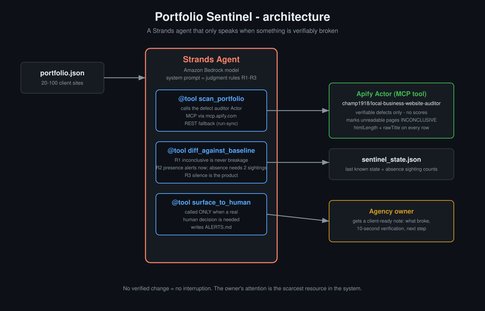

# Portfolio Sentinel

**A Strands agent that watches a web agency's client sites and only speaks when something is verifiably broken.**

Built for the AWS *Agents for Humans* hackathon — Professional Agents track.

---

## The problem

A small web-design agency maintains 20–100 client sites. Nobody re-checks them after launch. The first person to notice a dead call button is usually the client — or nobody, forever. A plumber's site with 14 broken tap-to-call links loses real revenue every day it goes unnoticed.

Checking is the worst kind of work: repetitive (every site, every week), boring (nothing changes 95% of the time), and judgment-heavy when something *does* change — because a 403 is not an outage, a CDN challenge page is not a missing meta tag, and a labelled multi-location phone menu is not "inconsistent contact info."

That judgment is exactly what naive monitoring gets wrong, and why agencies turn alerts off.

## The agent

Portfolio Sentinel runs in the background and applies the judgment:

1. **Scans** the portfolio with a defect auditor ([champ1918/local-business-website-auditor](https://apify.com/champ1918/local-business-website-auditor)) that marks unreadable pages **INCONCLUSIVE instead of guessing** — the auditor itself was hardened against 403s, timeouts, and ~12 KB bot-challenge stubs after each produced false accusations in production.
2. **Diffs** against the last known state. The diff engine encodes three rules learned from real incidents:
   - **R1 — Inconclusive is never breakage.** A page nobody received proves nothing.
   - **R2 — Presence beats absence.** A malformed `tel:` link is *on the page* → alert now. A "missing" tag might be a stub lying to the crawler → needs two confirmed sightings.
   - **R3 — Silence is the product.** No verified change → no interruption. One-line all-clear.
3. **Triages with the model** (Strands agent loop): decides whether the diff crosses the "real human decision" bar, and writes the client-ready note — which client, what broke, how to verify it in ten seconds, suggested next step.
4. **Surfaces** only then. Cleared defects get one sentence — fixed defects are billable proof of work.

## Architecture

```
portfolio.json ──► [ Strands Agent ]
                     │  system prompt = the judgment rules
                     │
                     ├── tool: scan_portfolio ──► Apify auditor Actor
                     │        (MCP via mcp.apify.com, REST fallback)
                     │
                     ├── tool: diff_against_baseline ──► sentinel_state.json
                     │        (R1/R2/R3 encoded as code, unit-tested)
                     │
                     └── tool: surface_to_human ──► ALERTS.md + console
                              (called ONLY when a decision is needed)
```



## Run it

```bash
pip install strands-agents
export APIFY_TOKEN=...        # Apify Console → API & Integrations
# AWS credentials for Bedrock (default model provider)

python src/sentinel.py portfolio.example.json
```

First run establishes the baseline. Subsequent runs diff against it. Schedule it (cron, EventBridge, AgentCore) and forget it — that's the point.

## Tests

The judgment rules are code, not vibes:

```bash
python test_baseline.py
```

Covers: presence-high alerts immediately; absence findings held until a second confirmed sighting; readable→inconclusive becomes a watch, never an alert; fixed defects surface as cleared.

## Why the auditor refuses to guess

The tool this agent depends on was hardened the hard way: the same URL returned 223,502 bytes → 0 findings and 11,951 bytes → 5 phantom findings minutes apart — a CDN serving a challenge page to datacenter IPs. The full story and fixes: [auditor repo](https://github.com/TaxGiraffe/local-business-website-auditor).

An agent that alerts on data like that trains its owner to ignore it. This one was built not to.

## License

MIT
